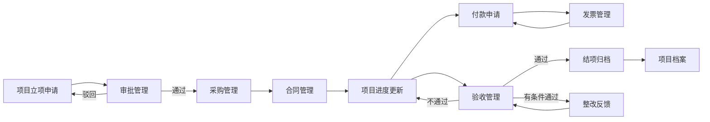
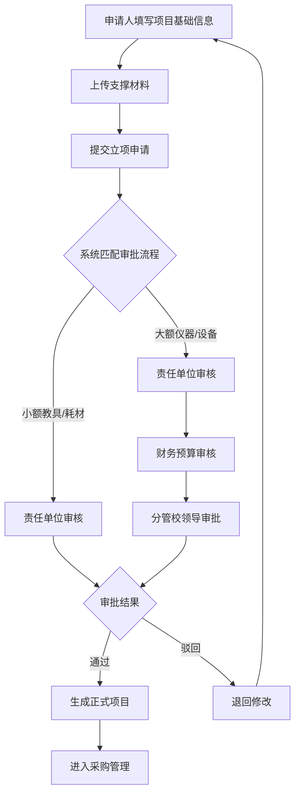
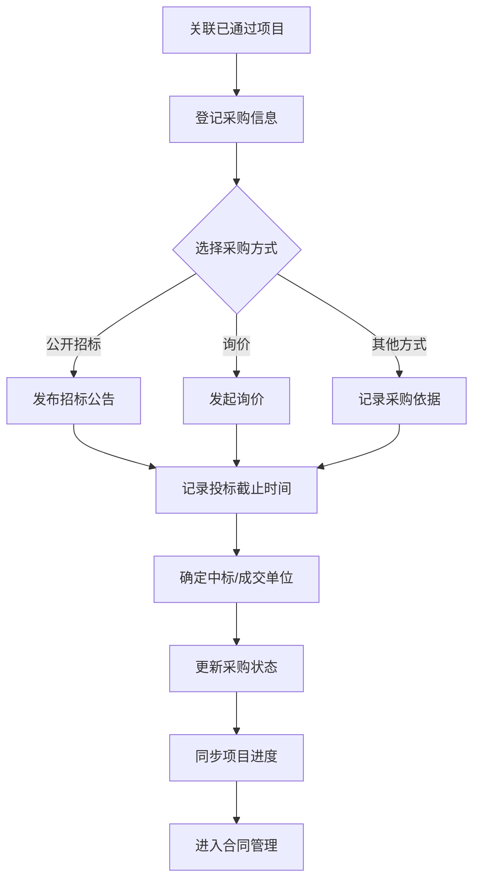
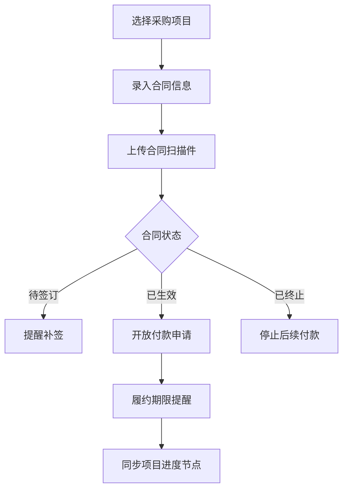
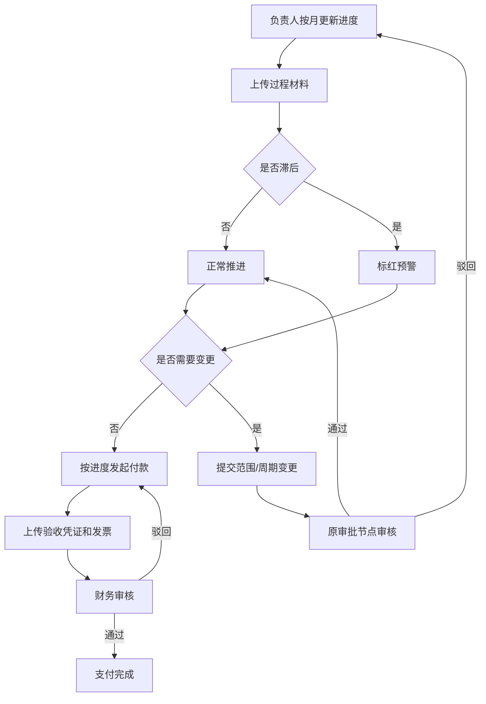
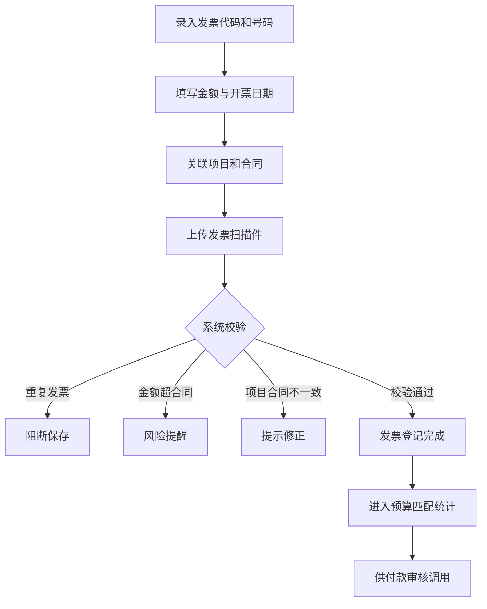
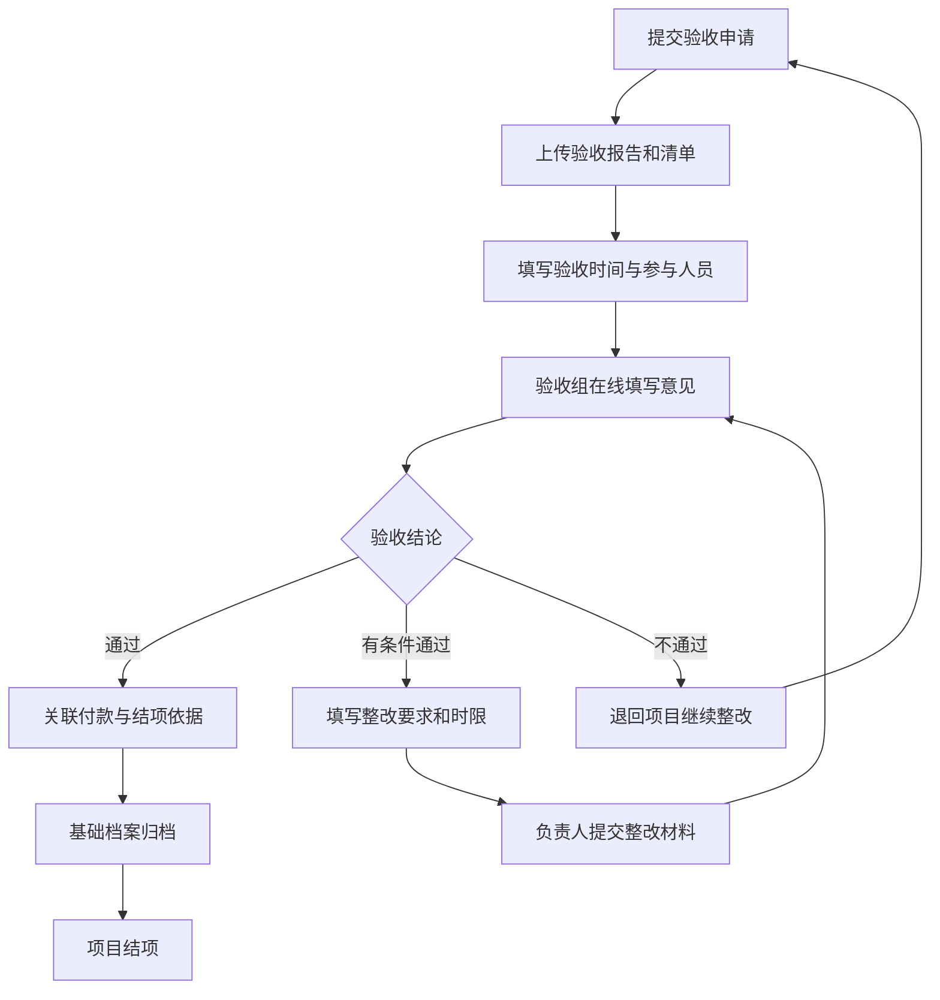
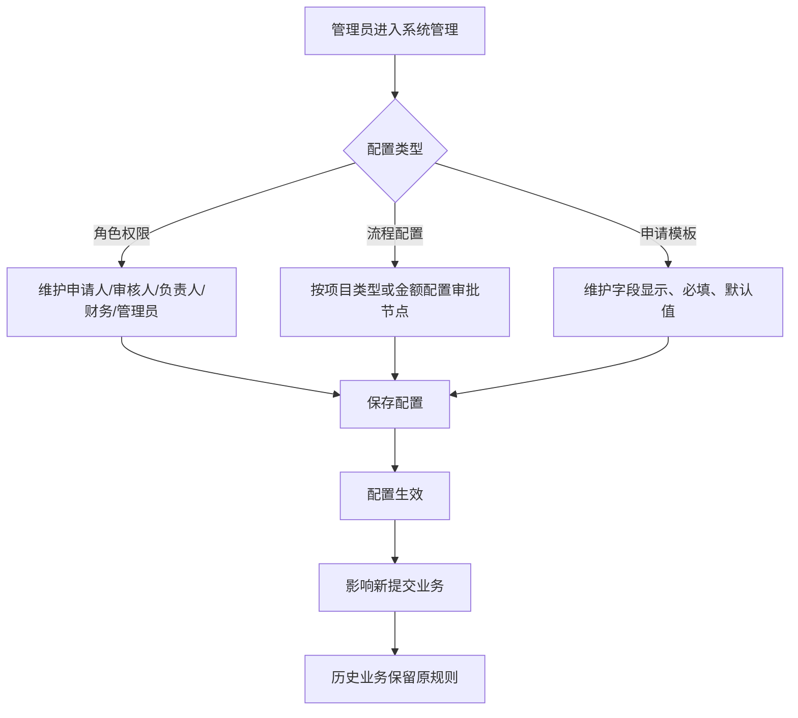
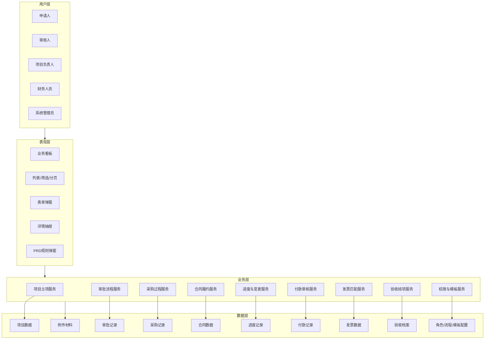
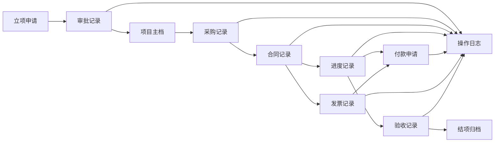

# 教学采购项目管理系统：业务流程图与架构图

## 1. 全生命周期总流程

```mermaid
flowchart LR
  A["项目立项申请"] --> B["审批管理"]
  B -->|通过| C["采购管理"]
  B -->|驳回| A
  C --> D["合同管理"]
  D --> E["项目进度更新"]
  E --> F["付款申请"]
  F --> G["发票管理"]
  E --> H["验收管理"]
  H -->|通过| I["结项归档"]
  H -->|有条件通过| J["整改反馈"]
  J --> H
  H -->|不通过| E
  G --> F
  I --> K["项目档案"]
```

## 2. 项目立项与审批流程

```mermaid
flowchart TD
  A["申请人填写项目基础信息"] --> B["上传支撑材料"]
  B --> C["提交立项申请"]
  C --> D{"系统匹配审批流程"}
  D -->|小额教具/耗材| E["责任单位审核"]
  D -->|大额仪器/设备| F["责任单位审核"]
  F --> G["财务预算审核"]
  G --> H["分管校领导审批"]
  E --> I{"审批结果"}
  H --> I
  I -->|通过| J["生成正式项目"]
  I -->|驳回| K["退回修改"]
  K --> A
  J --> L["进入采购管理"]
```

## 3. 采购管理流程

```mermaid
flowchart TD
  A["关联已通过项目"] --> B["登记采购信息"]
  B --> C{"选择采购方式"}
  C -->|公开招标| D["发布招标公告"]
  C -->|询价| E["发起询价"]
  C -->|其他方式| F["记录采购依据"]
  D --> G["记录投标截止时间"]
  E --> G
  F --> G
  G --> H["确定中标/成交单位"]
  H --> I["更新采购状态"]
  I --> J["同步项目进度"]
  J --> K["进入合同管理"]
```

## 4. 合同管理流程

```mermaid
flowchart TD
  A["选择采购项目"] --> B["录入合同信息"]
  B --> C["上传合同扫描件"]
  C --> D{"合同状态"}
  D -->|待签订| E["提醒补签"]
  D -->|已生效| F["开放付款申请"]
  D -->|已终止| G["停止后续付款"]
  F --> H["履约期限提醒"]
  H --> I["同步项目进度节点"]
```

## 5. 项目进度、变更与付款流程

```mermaid
flowchart TD
  A["负责人按月更新进度"] --> B["上传过程材料"]
  B --> C{"是否滞后"}
  C -->|否| D["正常推进"]
  C -->|是| E["标红预警"]
  D --> F{"是否需要变更"}
  E --> F
  F -->|否| G["按进度发起付款"]
  F -->|是| H["提交范围/周期变更"]
  H --> I["原审批节点审核"]
  I -->|通过| D
  I -->|驳回| A
  G --> J["上传验收凭证和发票"]
  J --> K["财务审核"]
  K -->|通过| L["支付完成"]
  K -->|驳回| G
```

## 6. 发票管理流程

```mermaid
flowchart TD
  A["录入发票代码和号码"] --> B["填写金额与开票日期"]
  B --> C["关联项目和合同"]
  C --> D["上传发票扫描件"]
  D --> E{"系统校验"}
  E -->|重复发票| F["阻断保存"]
  E -->|金额超合同| G["风险提醒"]
  E -->|项目合同不一致| H["提示修正"]
  E -->|校验通过| I["发票登记完成"]
  I --> J["进入预算匹配统计"]
  J --> K["供付款审核调用"]
```

## 7. 验收与结项流程

```mermaid
flowchart TD
  A["提交验收申请"] --> B["上传验收报告和清单"]
  B --> C["填写验收时间与参与人员"]
  C --> D["验收组在线填写意见"]
  D --> E{"验收结论"}
  E -->|通过| F["关联付款与结项依据"]
  E -->|有条件通过| G["填写整改要求和时限"]
  G --> H["负责人提交整改材料"]
  H --> D
  E -->|不通过| I["退回项目继续整改"]
  I --> A
  F --> J["基础档案归档"]
  J --> K["项目结项"]
```

## 8. 系统管理流程

```mermaid
flowchart TD
  A["管理员进入系统管理"] --> B{"配置类型"}
  B -->|角色权限| C["维护申请人/审核人/负责人/财务/管理员"]
  B -->|流程配置| D["按项目类型或金额配置审批节点"]
  B -->|申请模板| E["维护字段显示、必填、默认值"]
  C --> F["保存配置"]
  D --> F
  E --> F
  F --> G["配置生效"]
  G --> H["影响新提交业务"]
  H --> I["历史业务保留原规则"]
```

## 9. 系统功能架构图

```mermaid
flowchart TB
  subgraph U["用户层"]
    U1["申请人"]
    U2["审核人"]
    U3["项目负责人"]
    U4["财务人员"]
    U5["系统管理员"]
  end

  subgraph P["表现层"]
    P1["业务看板"]
    P2["列表/筛选/分页"]
    P3["表单弹窗"]
    P4["详情抽屉"]
    P5["PRD规则弹窗"]
  end

  subgraph B["业务层"]
    B1["项目立项服务"]
    B2["审批流程服务"]
    B3["采购过程服务"]
    B4["合同履约服务"]
    B5["进度与变更服务"]
    B6["付款审核服务"]
    B7["发票匹配服务"]
    B8["验收结项服务"]
    B9["权限与模板服务"]
  end

  subgraph D["数据层"]
    D1["项目数据"]
    D2["审批记录"]
    D3["采购记录"]
    D4["合同数据"]
    D5["进度记录"]
    D6["付款记录"]
    D7["发票数据"]
    D8["验收档案"]
    D9["角色/流程/模板配置"]
    D10["附件材料"]
  end

  U --> P
  P --> B
  B1 --> D1
  B2 --> D2
  B3 --> D3
  B4 --> D4
  B5 --> D5
  B6 --> D6
  B7 --> D7
  B8 --> D8
  B9 --> D9
  B --> D10
```

## 10. 数据流转架构图

```mermaid
flowchart LR
  A["立项申请"] --> B["审批记录"]
  B --> C["项目主档"]
  C --> D["采购记录"]
  D --> E["合同记录"]
  E --> F["进度记录"]
  F --> G["付款申请"]
  E --> H["发票记录"]
  H --> G
  F --> I["验收记录"]
  I --> J["结项归档"]
  B --> K["操作日志"]
  D --> K
  E --> K
  F --> K
  G --> K
  H --> K
  I --> K
```

