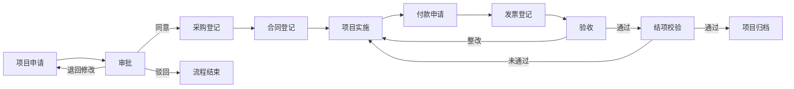
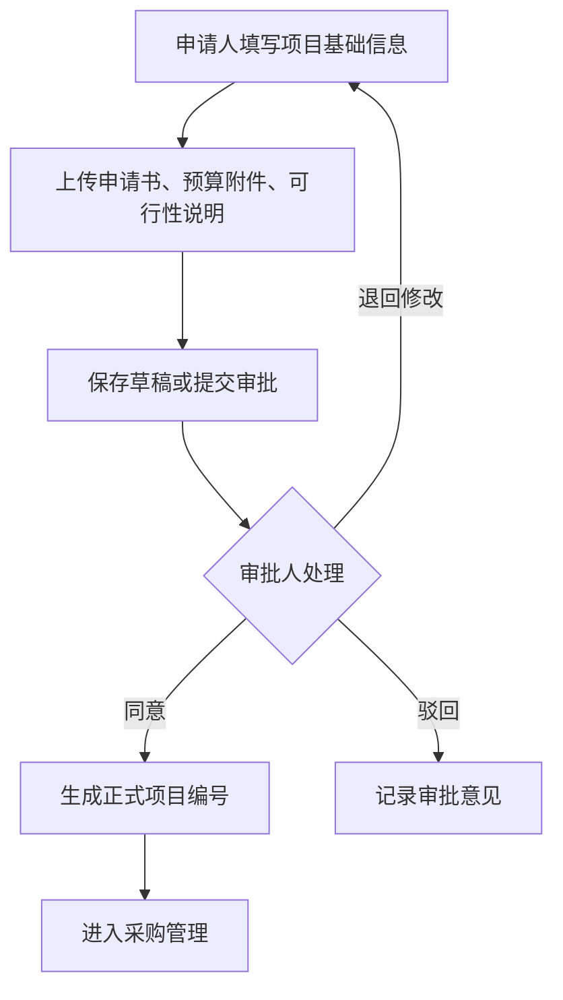
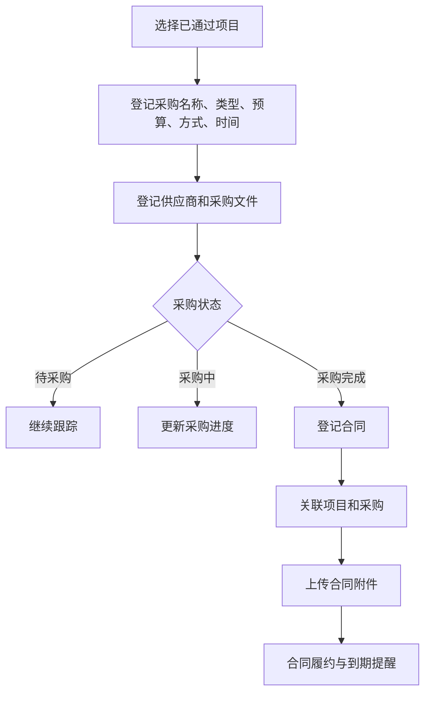
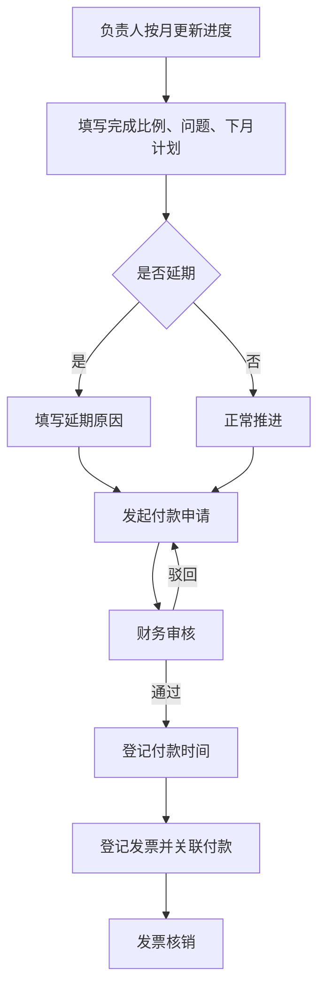
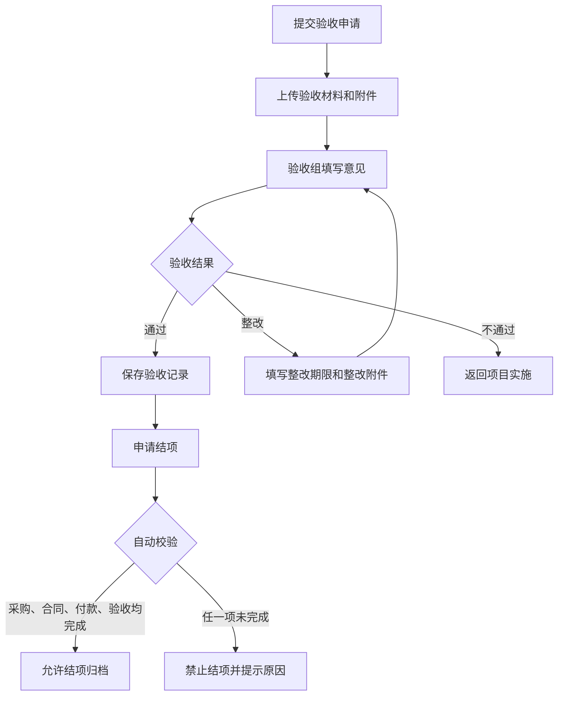
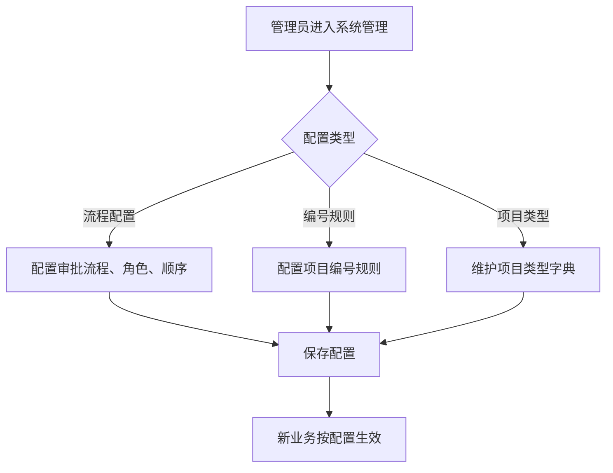
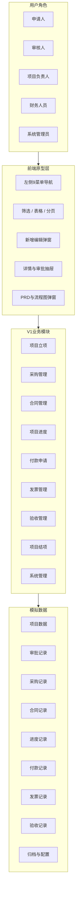

# V1 轻量级项目全过程管理：业务流程与架构图

## 1. V1 全流程

```mermaid
flowchart LR
  A["项目申请"] --> B["审批"]
  B -->|同意| C["采购登记"]
  B -->|退回修改| A
  B -->|驳回| Z["流程结束"]
  C --> D["合同登记"]
  D --> E["项目实施"]
  E --> F["付款申请"]
  F --> G["发票登记"]
  G --> H["验收"]
  H -->|整改| E
  H -->|通过| I["结项校验"]
  I -->|通过| J["项目归档"]
  I -->|未通过| E
```

## 2. 项目立项流程

```mermaid
flowchart TD
  A["申请人填写项目基础信息"] --> B["上传申请书、预算附件、可行性说明"]
  B --> C["保存草稿或提交审批"]
  C --> D{"审批人处理"}
  D -->|同意| E["生成正式项目编号"]
  D -->|退回修改| A
  D -->|驳回| F["记录审批意见"]
  E --> G["进入采购管理"]
```

## 3. 采购与合同流程

```mermaid
flowchart TD
  A["选择已通过项目"] --> B["登记采购名称、类型、预算、方式、时间"]
  B --> C["登记供应商和采购文件"]
  C --> D{"采购状态"}
  D -->|待采购| E["继续跟踪"]
  D -->|采购中| F["更新采购进度"]
  D -->|采购完成| G["登记合同"]
  G --> H["关联项目和采购"]
  H --> I["上传合同附件"]
  I --> J["合同履约与到期提醒"]
```

## 4. 进度、付款与发票流程

```mermaid
flowchart TD
  A["负责人按月更新进度"] --> B["填写完成比例、问题、下月计划"]
  B --> C{"是否延期"}
  C -->|是| D["填写延期原因"]
  C -->|否| E["正常推进"]
  D --> F["发起付款申请"]
  E --> F
  F --> G["财务审核"]
  G -->|通过| H["登记付款时间"]
  G -->|驳回| F
  H --> I["登记发票并关联付款"]
  I --> J["发票核销"]
```

## 5. 验收与结项流程

```mermaid
flowchart TD
  A["提交验收申请"] --> B["上传验收材料和附件"]
  B --> C["验收组填写意见"]
  C --> D{"验收结果"}
  D -->|通过| E["保存验收记录"]
  D -->|整改| F["填写整改期限和整改附件"]
  D -->|不通过| G["返回项目实施"]
  F --> C
  E --> H["申请结项"]
  H --> I{"自动校验"}
  I -->|采购、合同、付款、验收均完成| J["允许结项归档"]
  I -->|任一项未完成| K["禁止结项并提示原因"]
```

## 6. 系统管理流程

```mermaid
flowchart TD
  A["管理员进入系统管理"] --> B{"配置类型"}
  B -->|流程配置| C["配置审批流程、角色、顺序"]
  B -->|编号规则| D["配置项目编号规则"]
  B -->|项目类型| E["维护项目类型字典"]
  C --> F["保存配置"]
  D --> F
  E --> F
  F --> G["新业务按配置生效"]
```

## 7. V1 功能架构

```mermaid
flowchart TB
  subgraph U["用户角色"]
    U1["申请人"]
    U2["审核人"]
    U3["项目负责人"]
    U4["财务人员"]
    U5["系统管理员"]
  end

  subgraph P["前端原型层"]
    P1["左侧9菜单导航"]
    P2["筛选 / 表格 / 分页"]
    P3["新增编辑弹窗"]
    P4["详情与审批抽屉"]
    P5["PRD与流程图弹窗"]
  end

  subgraph B["V1业务模块"]
    B1["项目立项"]
    B2["采购管理"]
    B3["合同管理"]
    B4["项目进度"]
    B5["付款申请"]
    B6["发票管理"]
    B7["验收管理"]
    B8["项目结项"]
    B9["系统管理"]
  end

  subgraph D["模拟数据"]
    D1["项目数据"]
    D2["审批记录"]
    D3["采购记录"]
    D4["合同记录"]
    D5["进度记录"]
    D6["付款记录"]
    D7["发票记录"]
    D8["验收记录"]
    D9["归档与配置"]
  end

  U --> P
  P --> B
  B --> D
```
