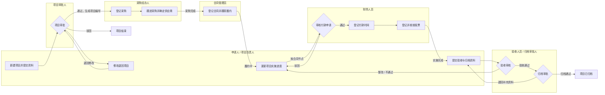
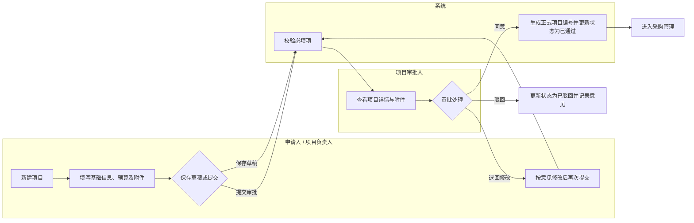
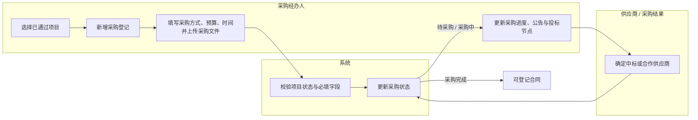
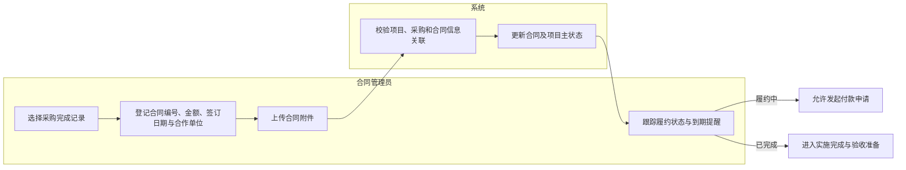
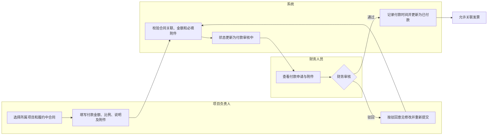
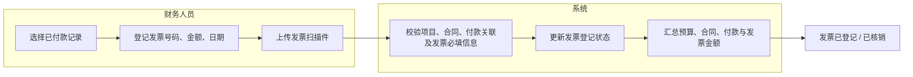
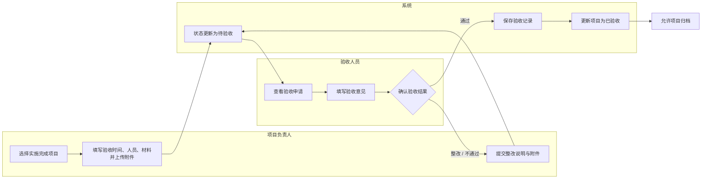
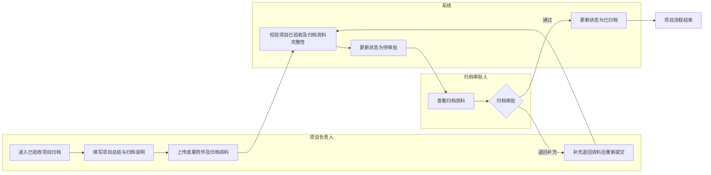
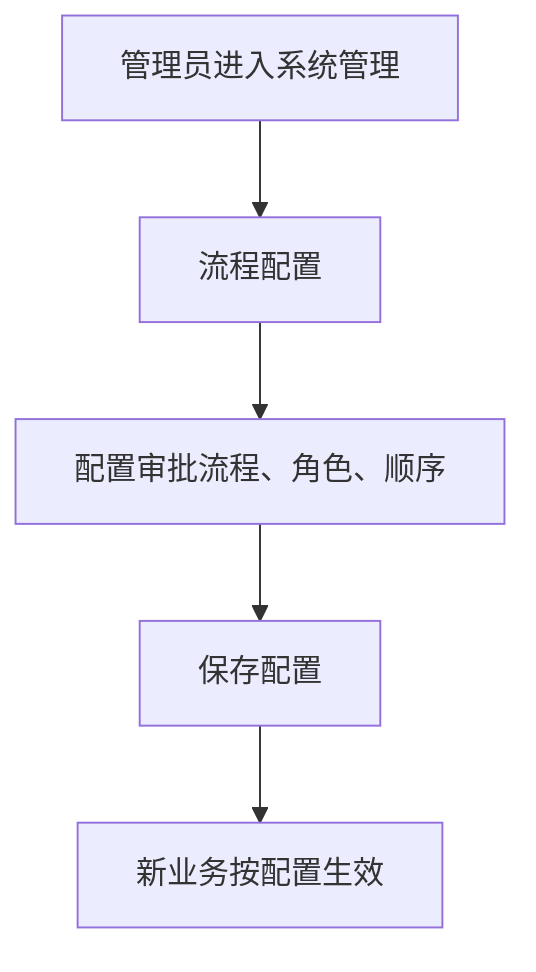
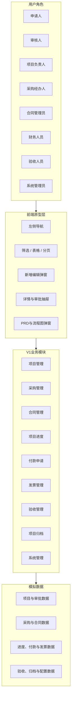

# V1 轻量级项目全过程管理：业务流程与架构图

## 1. 项目全生命周期泳道图

## 2. 项目管理操作泳道图

## 3. 采购管理操作泳道图

## 4. 合同管理操作泳道图

## 5. 付款申请操作泳道图

## 6. 发票管理操作泳道图

## 7. 验收管理操作泳道图

## 8. 项目归档操作泳道图

## 9. 系统管理流程

## 10. V1 功能架构

